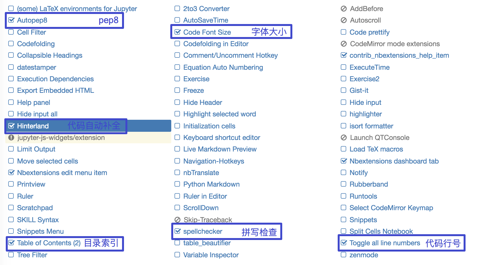

## 第001课：初识Python

### Python简介

Python是由荷兰人吉多·范罗苏姆（Guido von Rossum，后面都称呼他为Guido）发明的一种编程语言。

#### Python的历史

1. 1989年圣诞节：Guido开始写Python语言的编译器。
2. 1991年2月：第一个Python解释器诞生，它是用C语言实现的，可以调用C语言的库函数。
3. 1994年1月：Python 1.0正式发布。
4. 2000年10月：Python 2.0发布，Python的整个开发过程更加透明，生态圈开始慢慢形成。
5. 2008年12月：Python 3.0发布，引入了诸多现代编程语言的新特性，但并不完全兼容之前的Python代码。

> **说明**：大多数软件的版本号一般分为三段，形如A.B.C，其中A表示大版本号，当软件整体重写升级或出现不向后兼容的改变时，才会增加A；B表示功能更新，出现新功能时增加B；C表示小的改动（例如：修复了某个Bug），只要有修改就增加C。

#### Python的优点

Python的优点很多，简单为大家列出几点。

1. 简单明确，跟其他很多语言相比，Python更容易上手。
2. 开放源代码，拥有强大的社区和生态圈。
3. 能够在Windows、macOS、Linux等各种系统上运行。

#### Python的应用领域

目前Python在**Web服务器应用开发**、云基础设施开发、**网络数据采集**（爬虫）、**数据分析**、量化交易、**机器学习**、**深度学习**、**自动化测试**、**自动化运维**等领域都有用武之地。

### 安装Python环境

想要开始你的Python编程之旅，首先得在计算机上安装Python环境，简单的说就是得安装运行Python程序的工具，通常也称之为Python解释器。我们强烈建议大家安装Python 3的环境，很明显它是目前更好的选择。

#### Windows环境

可以直接点击[Python下载链接](<https://www.python.org/ftp/python/3.7.2/python-3.7.2-amd64.exe>)。

对于Windows操作系统，可以下载“executable installer”。需要注意的是，如果在Windows 7环境下安装Python 3，需要先安装Service Pack 1补丁包，大家可以在Windows的“运行”中输入`winver`命令，从弹出的窗口上可以看到你的系统是否安装了该补丁包。如果没有该补丁包，一定要先通过“Windows Update”或者类似“CCleaner”这样的工具自动安装该补丁包，安装完成后通常需要重启你的Windows系统，然后再开始安装Python环境。


双击运行刚才下载的安装程序，会打开Python环境的安装向导。在执行安装向导的时候，记得勾选“Add Python 3.x to PATH”选项，这个选项会帮助我们将Python的解释器添加到PATH环境变量中（不理解没关系，照做就行），具体的步骤如下图所示。


安装完成后可以打开Windows的“命令行提示符”工具并输入`python --version`或`python -V`来检查安装是否成功，命令行提示符可以在“运行”中输入`cmd`来打开或者在“开始菜单”的附件中找到它。如果看了Python解释器对应的版本号（如：Python 3.7.8），说明你的安装已经成功了，如下图所示。


pip换源终端输入下面内容：

- **md  %HOMEPATH%\pip\ && echo [global] > %HOMEPATH%\pip\pip.ini &&echo index-url = https://pypi.tuna.tsinghua.edu.cn/simple >> %HOMEPATH%\pip\pip.ini && echo pip换源成功**


> **说明**：如果安装过程显示安装失败或执行上面的命令报错，很有可能是因为你的Windows系统缺失了一些动态链接库文件而导致的问题。如果系统显示api-ms-win-crt\*.dll文件缺失，可以在[微软官网](https://www.microsoft.com/zh-cn/download/details.aspx?id=48145)下载Visual C++ Redistributable for Visual Studio 2015文件进行修复，64位的系统需要下载有x64标记的安装文件。如果是因为安装游戏时更新了Windows的DirectX之后导致某些动态链接库文件缺失问题，可以下载一个[DirectX修复工具](<https://dl.pconline.com.cn/download/360074-1.html>)进行修复。

#### macOS环境

macOS自带了Python 2，但是我们需要安装和使用的是Python 3。可以通过Python官方网站提供的[下载链接](<https://www.python.org/downloads/release/python-376/>)找到适合macOS的“macOS installer”来安装Python 3，安装过程基本不需要做任何勾选，直接点击“下一步”即可。安装完成后，可以在macOS的“终端”工具中输入`python3`命令来调用Python 3解释器，因为如果直接输入`python`，将会调用Python 2的解释器。

## 安装Jupyter Notebook环境

***************

###  Jupyter Notebook介绍

Jupyter项目是一个非盈利的开源项目，源于2014年的ipython项目，因为它逐渐发展为支持跨所有编程语言的交互式数据科学和科学计算

* Jupyter Notebook，原名IPython Notbook，是IPython的加强网页版，一个开源Web应用程序

* 名字源自Julia、Python 和 R（数据科学的三种开源语言）
* 是一款程序员和科学工作者的**编程/文档/笔记/展示**软件
* **.ipynb**文件格式是用于计算型叙述的**JSON文档格式**的正式规范


### 为什么使用Jupyter Notebook

- 传统软件开发：工程／目标明确
  - 需求分析，设计架构，开发模块，测试
- 数据挖掘：艺术／目标不明确
  - 目的是具体的洞察目标，而不是机械的完成任务
  - 通过执行代码来理解问题
  - 迭代式地改进代码来改进解决方法

实时运行的代码、叙事性的文本和可视化被整合在一起，方便使用代码和数据来讲述故事。特别适合做笔记。并且可以上传到github/gitee上面 手机/平板/pc 方便观看


**对比Jupyter Notebook和Pycharm**

- 画图


* 数据展示


- 总结：Jupyter Notebook 相比 Pycharm 在画图和数据展示方面更有优势。

## 安装Jupyter Notebook

终端输入：pip3 install jupyter

## jupyter 配置

- 生成配置文件

  - **jupyter notebook --generate-config**

- linux 用户 编辑 
  - **vim ~/.jupyter/jupyter_notebook_config.py**
- windows用户如下操作


  - 第一种:
    - **C:%HOMEPATH%/.jupyter/jupyter_notebook_config.py**

    - 添加下面内容
        - c.NotebookApp.ip = '*'
        - c.NotebookApp.open_browser = False
        - c.NotebookApp.port = 8888
        - c.NotebookApp.notebook_dir = '你的code路径'
  - 第二种

      - echo "c.NotebookApp.ip = '*'
      - c.NotebookApp.open_browser = False
      - c.NotebookApp.port = 8888
      - c.NotebookApp.notebook_dir = '你的code路径'" >> C:%HOMEPATH%/.jupyter/jupyter_notebook_config.py

- 生成访问密码
    - **jupyter notebook password**

- 运行jupyter
    - **jupyter notebook**

- linux不需要终端运行（高级操作）：
    - **nohup jupyter notebook --allow-root > jupyter.log 2>&1 &**

## Jupyter Notebook的使用-helloworld

### 界面启动、创建文件

####  界面启动

环境搭建好后，本机输入jupyter notebook命令，会自动弹出浏览器窗口打开Jupyter Notebook


本地notebook的默认URL为：http://localhost:8888

想让notebook打开指定目录，只要进入此目录后执行命令即可


####  新建notebook文档

- notebook的文档格式是`.ipynb`


#### 内容界面操作-helloworld

**标题栏：**点击标题（如Untitled）修改文档名

**编辑栏：**


### cell操作

- 什么是cell？
  - **cell**：一对In Out会话被视作一个代码单元，称为cell
  - cell行号前的 * ，表示代码正在运行

Jupyter支持两种模式：

- 编辑模式（Enter）
  - 命令模式下`回车Enter`或`鼠标双击`cell进入编辑模式
  - 可以**操作cell内文本**或代码，剪切／复制／粘贴移动等操作
- 命令模式（Esc）
  - 按`Esc`退出编辑，进入命令模式
  - 可以**操作cell单元本身**进行剪切／复制／粘贴／移动等操作

#### 鼠标操作


#### 快捷键操作

- 两种模式通用快捷键
  - **`Shift+Enter`，执行本单元代码，并跳转到下一单元**
  - **`Ctrl+Enter`，执行本单元代码，留在本单元**

- **命令模式**：按ESC进入
  - `Y`，cell切换到Code模式
  - `M`，cell切换到Markdown模式
  - `A`，在当前cell的上面添加cell
  - `B`，在当前cell的下面添加cell

- 其他(了解)
  - `双击D`：删除当前cell
  - `Z`，回退
  - `L`，为当前cell加上行号 <!--
  - `Ctrl+Shift+P`，对话框输入命令直接运行
  - 快速跳转到首个cell，`Crtl+Home`
  - 快速跳转到最后一个cell，`Crtl+End` -->

- **编辑模式**：按Enter进入
  - 补全代码：变量、方法后跟`Tab键`
  - 为一行或多行代码添加/取消注释：`Ctrl+/`（Mac:CMD+/）

- 其他(了解)：
  - 多光标操作：`Ctrl键点击鼠标`（Mac:CMD+点击鼠标）
  - 回退：`Ctrl+Z`（Mac:CMD+Z）
  - 重做：`Ctrl+Y`（Mac:CMD+Y)

### markdown演示

掌握标题和缩进即可


# 一级标题

## 二级标题

### 三级标题

#### 四级标题

##### 五级标题

- 缩进
  - 二级缩进
    - 三级缩进

## Jupyter Notebook中自动补全代码等相关功能拓展【了解】

效果展示：


安装jupyter_contrib_nbextensions库

安装该库的命令如下：

```shell
python -m pip install jupyter_contrib_nbextensions
```

然后执行：

```shell
jupyter contrib nbextension install --user --skip-running-check
```

在原来的基础上勾选： “Table of Contents” 以及 “Hinterland”

部分功能：




## 总结


### 总结

到这里，大家已经对Python语言有一个基本的了解，知道它可以做很多的事情，所以也值得我们去学习。要用Python做开发，首先需要在自己的计算机上安装Python环境，上面我们为大家介绍了macOS和Windows两种环境下Python 3环境的安装方法，希望大家都能顺利的安装成功，以便开启我们后续的学习。
